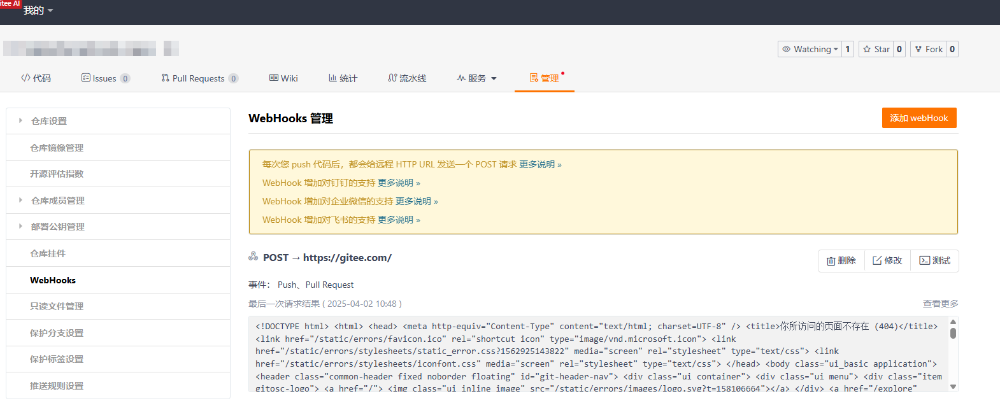

# 新增源码管理平台

当前版本已内置支持腾讯TGIT代码库，如已有其他平台SDK，则仅需补充适配模块即可，本文以[giteeSdk](https://gitee.com/sdk/gitee5j.git)为例，演示操作流程

参考：[项目结构介绍](./PROJECT_STRUCTURE.md)

## 1.指定服务提供者标识
````java
/**
 * 源码管理平台提供者
 */
public enum ScmProviderCodes {
    TGIT("tgit"),
    TSVN("tsvn"),
    GITHUB("github"),
    GITLAB("gitlab"),
    // 增加Gitee提供者标识
    GITEE("gitee"),
    ;
    public final String value;

    ScmProviderCodes(String value) {
        this.value = value;
    }

    @JsonValue
    public String toValue() {
        return value;
    }

    @Override
    public String toString() {
        return value;
    }
}
````

## 2. 平台适配模块开发
此模块主要用于将对 [ devops-scm-sdk-{scmCode}] 模块与 [devops-scm-api] 模块以及第三方服务进行平滑对接，主要包含以下功能：
- [devops-scm-sdk] 模块的原始请求数据转化为 [devops-scm-api] 模块所定义的数据类型，
- 同时用于解析 webhook元数据 ，组装webhook触发参数以及关联的要素信息
- 将蓝盾平台的凭证转化为sdk支持的授权提供者

### 2.1 新建module
增加 devops-scm-provider-gitee-simple 模块，基于[devops-scm-provider/devops-scm-provider-git]目录右键 'New' -> 'Module'

### 2.2 增加授权适配器

新建 GiteeTokenAuthProvider 类，用于实现 HTTP 授权认证接口，其中授权信息位于request header中

````java

````

### 2.2 增加授权适配器
为保障系统安全性，调用Gitee服务端API接口需进行身份认证。现针对Gitee社区版平台开发了授权提供者模块，当前版本支持以下两种授权机制：
- Oauth Access Token
- Personal Access Token


由于关联代码库时凭证类型不固定，因此需要针对gitee5j sdk进行授权适配，将代码库关联的授权信息注入到sdk内，目前针对gitee授权主要有三种：

| 授权类型  | 凭证类型                        | 凭证实体类                                            |
|-------|-----------------------------|----------------------------------------------------------------|
| OAUTH | oauth token                 | com.tencent.devops.scm.api.pojo.auth.AccessTokenScmAuth        |
| HTTP  | username + password + token | com.tencent.devops.scm.api.pojo.auth.TokenUserPassScmAuth      |
| SSH   | ssh private key + token     | com.tencent.devops.scm.api.pojo.auth.TokenSshPrivateKeyScmAuth |

蓝盾凭证实体类参考： com.tencent.devops.scm.api.pojo.auth.IScmAuth

````java
package com.tencent.devops.scm.provider.gitee.simple.auth;

import com.gitee.sdk.gitee5j.ApiClient;
import com.gitee.sdk.gitee5j.auth.OAuth;
import com.tencent.devops.scm.api.pojo.auth.AccessTokenScmAuth;
import com.tencent.devops.scm.api.pojo.auth.IScmAuth;
import com.tencent.devops.scm.api.pojo.auth.PersonalAccessTokenScmAuth;
import com.tencent.devops.scm.api.pojo.auth.TokenSshPrivateKeyScmAuth;
import com.tencent.devops.scm.api.pojo.auth.TokenUserPassScmAuth;
import lombok.NonNull;

public class GiteeTokenAuthProviderAdapter {

  private static final String AUTH_TYPE_OAUTH = "OAuth2";

  @NonNull
  private ApiClient apiClient;

  private GiteeTokenAuthProviderAdapter(ApiClient apiClient) {
    this.apiClient = apiClient;
  }

  public void withAuth(IScmAuth auth) {
    OAuth oAuth = (OAuth) apiClient.getAuthentication(AUTH_TYPE_OAUTH);
    String token = "";
    if (auth instanceof AccessTokenScmAuth) {
      token = ((AccessTokenScmAuth) auth).getAccessToken();
    } else if (auth instanceof PersonalAccessTokenScmAuth) {
      token = ((PersonalAccessTokenScmAuth) auth).getPersonalAccessToken();
    } else if (auth instanceof TokenUserPassScmAuth) {
      token = ((TokenUserPassScmAuth) auth).getToken();
    } else if (auth instanceof TokenSshPrivateKeyScmAuth) {
      token = ((TokenSshPrivateKeyScmAuth) auth).getToken();
    } else {
      throw new UnsupportedOperationException(String.format("gitAuth(%s) is not support", auth));
    }
    oAuth.setAccessToken(token);
  }
}
````

### 2.3 增加实体类转化工具类

目前 provider 模块有两种转化类：
- objectCovert: 将 [devops-scm-sdk-{scmCode}] 模块的原始数据对象转换为系统内部统一的数据模型对象

  参考：com.tencent.devops.scm.provider.git.tgit.TGitObjectConverter


- ObjectToMapConverter: 将 [devops-scm-sdk-{scmCode}] 模块的原始数据对象转换为Map<String, String>， 主要用于组装webhook触发变量

  参考：com.tencent.devops.scm.provider.git.tgit.TGitObjectToMapConverter

### 2.4 业务服务实现
在 [devops-scm-provider-gitee-simple] 模块下新建功能服务类实现 [devops-scm-api] 下的服务接口, 此处以 [仓库分支] 为例，实现RefService接口
````java
package com.tencent.devops.scm.provider.git.gitee;

import com.tencent.devops.scm.api.RefService;
import com.tencent.devops.scm.api.pojo.BranchListOptions;
import com.tencent.devops.scm.api.pojo.Change;
import com.tencent.devops.scm.api.pojo.Commit;
import com.tencent.devops.scm.api.pojo.CommitListOptions;
import com.tencent.devops.scm.api.pojo.ListOptions;
import com.tencent.devops.scm.api.pojo.Reference;
import com.tencent.devops.scm.api.pojo.ReferenceInput;
import com.tencent.devops.scm.api.pojo.TagListOptions;
import com.tencent.devops.scm.api.pojo.repository.ScmProviderRepository;
import com.tencent.devops.scm.api.pojo.repository.git.GitScmProviderRepository;
import com.tencent.devops.scm.provider.git.gitee.auth.GiteeTokenAuthProviderAdapter;
import com.tencent.devops.scm.sdk.common.connector.okhttp3.OkHttpScmConnector;
import com.tencent.devops.scm.sdk.gitee.GiteeApi;
import com.tencent.devops.scm.sdk.gitee.GiteeBranchesApi;
import com.tencent.devops.scm.sdk.gitee.auth.GiteeTokenAuthProvider;
import com.tencent.devops.scm.sdk.gitee.pojo.GiteeBranch;
import java.util.ArrayList;
import java.util.List;
import java.util.stream.Collectors;
import okhttp3.OkHttpClient;
import okhttp3.OkHttpClient.Builder;

public class GiteeRefService implements RefService {

  @Override
  public Reference findBranch(ScmProviderRepository repository, String name) {
    // 创建客户端
    ApiClient defaultClient = Configuration.getDefaultApiClient();
    GitScmProviderRepository gitScmProviderRepository = (GitScmProviderRepository) repository;
    // 绑定授权信信息
    new GiteeTokenAuthProviderAdapter(defaultClient).withAuth(gitScmProviderRepository.getAuth());
    RepositoriesApi repositoriesApi = new RepositoriesApi(defaultClient);
    // 仓库全名称(owner/repo)
    Pair<String, String> repoFullName = GiteeRepoInfoUtils.convertRepoName(
            gitScmProviderRepository.getProjectIdOrPath()
    );
    try {
      CompleteBranch branches = repositoriesApi.getReposOwnerRepoBranchesBranchWithHttpInfo(
              repoFullName.getLeft(),
              repoFullName.getRight(),
              name
      ).getData();
      // 结果转化
      return GiteeObjectConverter.convertBranches(branches);
    } catch (ApiException e) {
      throw new RuntimeException(e);
    }
  }

  @Override
  public List<Reference> listBranches(ScmProviderRepository repository, BranchListOptions opts) {
    // 创建客户端
    ApiClient defaultClient = Configuration.getDefaultApiClient();
    GitScmProviderRepository gitScmProviderRepository = (GitScmProviderRepository) repository;
    // 绑定授权信信息
    new GiteeTokenAuthProviderAdapter(defaultClient).withAuth(gitScmProviderRepository.getAuth());
    RepositoriesApi repositoriesApi = new RepositoriesApi(defaultClient);
    // 仓库全名称(owner/repo)
    Pair<String, String> repoFullName = GiteeRepoInfoUtils.convertRepoName(
            gitScmProviderRepository.getProjectIdOrPath()
    );
    try {
      List<Branch> branches = repositoriesApi.getReposOwnerRepoBranchesWithHttpInfo(
              repoFullName.getLeft(),
              repoFullName.getRight(),
              null,
              null,
              opts.getPage(),
              opts.getPageSize()
      ).getData();
      // 结果转化
      return branches.stream().map(GiteeObjectConverter::convertBranches).collect(Collectors.toList());
    } catch (ApiException e) {
      throw new RuntimeException(e);
    }
  }
}
````

### 2.5 优化代码，适配不同服务域名
从上述代码可以看到，<u>创建apiClient对象</u>、<u>转化仓库名</u>以及<u>填充授权信息</u>的动作比较重复，可对此部分逻辑进行抽取，同时由于sdk预先指定了服务域名，导致在对接
不同Gitee服务时（社区版/专业版）不方便，所以在此处对上述代码进行优化，主要包含两部分内容
- 优化apiClient创建过程： 创建GiteeApiClientFactory类，采用工厂模式统一创建apiClient对象，将API客户端的创建与使用分离，服务类不需要关心API客户端的构建细节
- 统一异常捕获以及repoName转化过程：创建GiteeApiTemplate类，采用模板模式对异常捕获以及repoName转化过程进行封装

调整后的结果：

[GiteeApiClientFactory](../devops-scm-provider/devops-scm-provider-git/devops-scm-provider-gitee-simple/src/main/java/com/tencent/devops/scm/provider/gitee/simple/GiteeApiClientFactory.java)

[GiteeApiTemplate](../devops-scm-provider/devops-scm-provider-git/devops-scm-provider-gitee-simple/src/main/java/com/tencent/devops/scm/provider/gitee/simple/GiteeApiTemplate.java)

[优化后的 GiteeRefService](../devops-scm-provider/devops-scm-provider-git/devops-scm-provider-gitee-simple/src/main/java/com/tencent/devops/scm/provider/gitee/simple/GiteeRefService.java)

### 2.6 Webhook支持
### 2.7 Webhook支持
适配模块需对webhook元数据信息解析，并且转化为 [devops-scm-api] 模块所规定的webhook类型，在此以 gitee 代码库的 push 以及 pull_request webhook事件为例介绍webhook解析相关流程

#### 2.7.1 确认webhook消息体数据结构
随意注册一个webhook，然后执行相应动作，提取push/pull_request的webhook元数据，不同操作对应的webhook元数据可能不同


|事件类型| 触发webhook的动作                                      |
|----|---------------------------------------------------|
|push| - 新增/删除分支<br/>- 推送更新                              |
|pull_request| - 新增/编辑/关闭/重新打开/合并pull_request<br/>- 基于pr的源分支推送更新 |

提取到的webhook元数据可参考：
- [push事件](../devops-scm-provider/devops-scm-provider-git/devops-scm-provider-gitee/src/test/resources/push_webhook.json)


- [pull_request事件](../devops-scm-provider/devops-scm-provider-git/devops-scm-provider-gitee/src/test/resources/pull_request_webhook.json)

#### 2.7.2 构建 gitee webhook 实体类
根据 webhook 元数据在 [devops-scm-sdk-gitee-simple] 模块创建对应的push/pull_request实体类

webhook实体类命名规则：Gitee{事件类型}Event

webhook实体类下级实体类命名规则：GiteeEvent{要素名}

例如：
- GiteePullRequestEvent -- pull_request 事件 webhook事件实体类

- GiteePushEvent -- push 事件 webhook事件实体类

- GiteeEventRepository -- webhook事件仓库实体类

- GiteeEventCommit -- webhook事件提交实体类

#### 2.7.3 解析webhook
在 [devops-scm-provider-gitee] 模块下增加webhook解析器和增强器，分别实现两个接口
- [WebhookParser](../devops-scm-api/src/main/java/com/tencent/devops/scm/api/WebhookParser.java) : webhook解析器，主要用于校验webhook有效性，同时根据不同的webhook 事件组装对应的[Webhook](../devops-scm-api/src/main/java/com/tencent/devops/scm/api/pojo/webhook/Webhook.java)实体类
- [WebhookEnricher](../devops-scm-api/src/main/java/com/tencent/devops/scm/api/WebhookEnricher.java)：webhook增强器，由于webhook元数据中的信息可能不足以补全[Webhook](../devops-scm-api/src/main/java/com/tencent/devops/scm/api/pojo/webhook/Webhook.java)实体类内的字段，需要额外调用服务端API才能补充，补充操作可在enrich方法内实现

参考：
- [TGitWebhookEnricher](../devops-scm-provider/devops-scm-provider-git/devops-scm-provider-tgit/src/main/java/com/tencent/devops/scm/provider/git/tgit/TGitWebhookEnricher.java)
- [TGitWebhookParser](../devops-scm-provider/devops-scm-provider-git/devops-scm-provider-tgit/src/main/java/com/tencent/devops/scm/provider/git/tgit/TGitWebhookParser.java)

#### 2.7.4 服务挂载
以上功能完成后，为了便于后续集成 spring-boot 以及同时也对service类进行统一管控，可以对相关service类以及webhook解析类
进行集成，需继承抽象类 [GitScmProvider](../devops-scm-provider/devops-scm-provider-git/devops-scm-provider-git-common/src/main/java/com/tencent/devops/scm/provider/git/command/GitScmProvider.java)，对其抽象方法进行完善

参考：

[TGitScmProvider](../devops-scm-provider/devops-scm-provider-git/devops-scm-provider-tgit/src/main/java/com/tencent/devops/scm/provider/git/tgit/TGitScmProvider.java)

[GiteeScmProvider](../devops-scm-provider/devops-scm-provider-git/devops-scm-provider-gitee-simple/src/main/java/com/tencent/devops/scm/provider/gitee/simple/GiteeScmProvider.java)
## 3. spring-boot自动装配
本项目支持集成到第三方spring-boot项目中，核心代码位于[devops-scm-spring-boot-starter](../devops-scm-spring-boot-starter)模块，主要包含两块内容
- manager
  <br>
  对已支持代码源服务进行统一管理，实现[ScmProviderFactory](../devops-scm-spring-boot-starter/src/main/java/com/tencent/devops/scm/spring/manager/ScmProviderFactory.java)接口，采用工厂模式创建具体的Provider，连接器相关配置
  可通过上层springboot进行注入，源码实现可参考：
  <br>
  [GiteeScmProviderFactory](../devops-scm-spring-boot-starter/src/main/java/com/tencent/devops/scm/spring/manager/GiteeScmProviderFactory.java)
  <br>
  [TGitScmProviderFactory](../devops-scm-spring-boot-starter/src/main/java/com/tencent/devops/scm/spring/manager/TGitScmProviderFactory.java)
- config
  <br>
  为了上层SpringBoot项目能对相关Provider进行自动装配，需创建springboot-configuration，对相关Provider进行挂载，
  相关源码可参考[ScmProviderConfiguration](../devops-scm-spring-boot-starter/src/main/java/com/tencent/devops/scm/spring/config/ScmProviderConfiguration.java)，服务挂载完毕后，还需对将相关Configuration类的全类名记录到[META-INF](../devops-scm-spring-boot-starter/src/main/resources/META-INF/spring/org.springframework.boot.autoconfigure.AutoConfiguration.imports)，以便
  上层SpringBoot项目能识别需要加载的Configuration类，从而自动创建Provider相关的bean对象