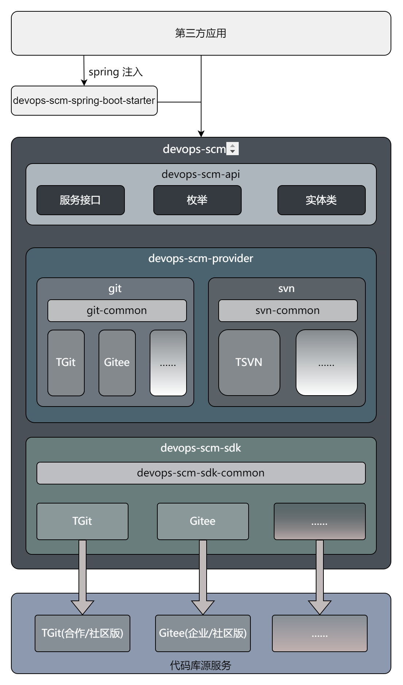

# 项目结构介绍

## 目录结构
````
├─config 项目配置
│  │
│  └─checkstyle 语法检查配置
│
├─devops-scm-api 核心接口定义模块（含接口、枚举、实体类），保持业务逻辑与实现分离，不执行具体业务逻辑
│
├─devops-scm-provider 源代码管理平台适配模块，实现[devops-scm-api]定义的接口规范，同时对[devops-scm-sdk]返回结果进行转化
│  │
│  ├─devops-scm-provider-git Git代码仓库适配模块
│  │  │
│  │  ├─devops-scm-provider-git-common Git通用功能模块
│  │  │
│  │  ├─devops-scm-provider-gitee Gitee平台专用适配实现
│  │  │
│  │  └─devops-scm-provider-tgit 腾讯TGit平台专用适配实现
│  │  
│  └─devops-scm-provider-svn SVN代码仓库适配模块
│      │
│      ├─devops-scm-provider-svn-common SVN通用功能模块
│      │
│      └─devops-scm-provider-tsvn 腾讯TSVN平台专用适配实现
│
├─devops-scm-sample 示例代码模块，展示各功能模块的使用方式
│
├─devops-scm-sdk 代码源服务对接模块，提供服务端接口调用 (注：SVN代码库目前暂无api调用)
│  │
│  ├─devops-scm-sdk-common SDK通用组件
│  │
│  ├─devops-scm-sdk-gitee Gitee平台专用SDK
│  │
│  └─devops-scm-sdk-tgit 腾讯TGit平台专用SDK
│
├─devops-scm-spring-boot-starter Spring Boot自动配置模块，提供开箱即用的集成方案
│
└─devops-scm-test 自动化测试模块，包含单元测试和集成测试用例
````

## 结构总览

